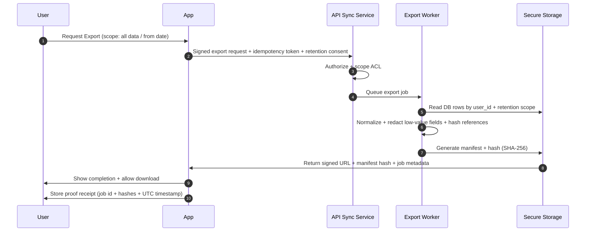
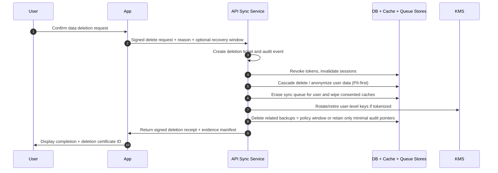

# ADR-017: Security & Encryption Architecture for Mobile FODMAP Recommendation App

## Context

- Mobile app strategy is React Native + Expo with offline-first cache and local mutation queue.
- App supports two modes: anonymous (no account identity) and authenticated account mode.
- Recommendation logic is backend-authoritative (`/v0/swaps` active rules only, deterministic sort).
- Symptom history, symptom-triggered swaps, and nutrition logs are sensitive health-adjacent data.
- French-first launch requires GDPR alignment and auditable privacy/deletion behavior.

## Status

- **Implemented** (controls referenced in launch evidence pack are operational and bound to API flows).

## Decision

Adopt a **three-layer trust model**:

1. **Transport-first integrity**: mTLS at auth + TLS 1.3 everywhere with API audience-scoped auth tokens and integrity headers for queue envelopes.
2. **Device envelope encryption**: encrypted local database + encrypted offline queue using hardware-protected root keys and per-user data keys.
3. **Backend encryption integration**: provider-managed disk encryption (KMS + envelope encryption) plus app-level tokenization/pseudonymization at sensitive fields.

## Data Classifications (What can move where)

- `PUBLIC`: static app text, feature flags, remote config hashes, non-personal metrics.
- `SENSITIVE`: symptom logs, diet records, recommendations accepted/declined, food IDs, swap interactions, language preference when linked to profile.
- `HIGH_SENSITIVE`: email/phone/user IDs, hashed/auth refresh credentials, access tokens, consent records.

## Trust-Boundary Data Flow (spec)

```mermaid
flowchart LR
  subgraph Device
    UI[React Native UI]\n(EN/FR content)
    LocalDB[(Encrypted Local DB\nSQLCipher)]
    Queue[(Offline Mutation Queue\nAES-256-GCM Envelope)]
    SecureStore[(Secure Storage\nHW-backed root keys)]
    KEK[Key Enrichment Service\nDevice Keys]
    Sync[Sync Engine\nBackoff + dedupe]
  end

  subgraph Network
    TLS[TLS 1.3 + cert validation\nAPI Gateway]
  end

  subgraph Backend
    Auth[Auth & Device/session service]
    API[Swap API + Business logic]
    QueueIn[Queue Ingress API]\n(validates signatures + replay guards)
    DB[(Primary DB encrypted at rest)]
    Blob[Encrypted object storage]\n(backups/exports)
    Audit[(Immutable audit log)]
  end

  UI -->|read/write| LocalDB
  UI -->|enqueue| Queue
  Queue --> Sync --> TLS --> QueueIn
  TLS --> Auth --> API
  API --> DB
  API --> Blob
  API --> Audit
  SecureStore --> KEK --> LocalDB
  SecureStore --> KEK --> Queue
  KEK -->|wrap/unwrap| Sync
  API -->|responses| TLS --> UI
```

### Sync policy for data placement

- **Device-only (never sync by default):**
  - UI telemetry for crashes (sanitized), device local performance metrics.
  - Draft entries in progress (before user finalize save).
  - Session-only cache warmup metadata and offline map tiles.
  - Biometric/session hints with no stable user key.

- **Sync-to-backend (account mode):**
  - User profile and consent metadata.
  - Symptom logs, diet records, swap actions, recommendation interactions.
  - Offline queue items after envelope verification and dedupe scheduling.
  - Sync metadata: device type/version, last sync cursor, conflict markers.

- **Sync-transformed (account mode):**
  - Analytics/events as bucketed aggregates and feature-specific counters.
  - Optional cohort IDs from hashed email/phone only (HMAC with rotating salt).
  - Queue payload redaction of raw free-text fields where not needed for support.

- **Anon mode:**
  - Use local ephemeral user identifier bound only to device.
  - No durable user profile sync.
  - Only locally persisted session state and optional anonymous crash/usage events with no cross-device identity.

## Encryption Design

### Data in transit

- HTTPS/TLS 1.3 with strong cipher suites only; HSTS on API and web origin.
- Access tokens use OAuth2/OIDC short-lived JWTs + refresh tokens.
- Queue API requests are additionally wrapped in a **signed envelope**:
  - `payload` (JSON), `ts`, `nonce`, `client_seq`, `device_id`, `app_install_id`, `signature`
  - Signature uses Ed25519 or ECDSA key provisioned at install.

### Data at rest (device)

- Local DB: SQLCipher/AES-256-GCM with page-level encryption.
- Queue item payload: per-item random CEK (symmetric key) encrypted by app-level KEK.
- KEK is generated/stored in Secure Storage tied to the OS key store/biometric unlock policy.
- Key hierarchy:
  - `HWRK` (Hardware-root key): never leaves secure enclave/Keystore.
  - `DEK_device`: envelope key for all local storage.
  - `CEK_item`: ephemeral content keys for queue records.
  - `SIGK_device`: signing key for queue integrity/non-repudiation.

### Data at rest (backend)

- Cloud/Postgres: managed volume and backup encryption (platform KMS).
- Sensitive columns use deterministic tokenization where analytics/joins are still needed.
- Object backups (exports, logs, queue dead letters): envelope encryption with dedicated KMS key per environment.

## Key lifecycle

1. **Generation**
   - Device installs generate new `DEK_device` and `SIGK_device` locally.
   - Authenticated users fetch a server-issued sync wrapping key only if account mode and device authorization succeed.

2. **Storage**
   - Raw keys stored only as wrapped bytes in secure storage; never in app logs.
   - Use platform secure APIs (iOS Keychain with access-group isolation; Android Keystore backed by StrongBox when available).

3. **Rotation**
   - `DEK_device`: rotate on reinstall, major app update, suspicious activity, or timed policy (e.g., 90 days).
   - `SIGK_device`: rotate every 30 days or after lockout.
   - Server-side app/user key wrappers rotated quarterly with grace window for in-flight queue items.

4. **Revocation**
   - Revocation happens on server logout-from-all-devices and token anomalies.
   - API rejects old signing fingerprints until re-attested.

5. **Reset behavior**
   - Password/identity reset reissues sync identity and invalidates old sync key.
   - Local queue is marked “untrusted”; only safe payloads remain in device-only store.

6. **Logout behavior**
   - Clear `access/refresh` tokens and remove wrapped `DEK_device` from secure store.
   - Hard-delete local encrypted DB pages for account-linked rows and tombstone local sync metadata.
   - Keep anonymous local profile only if user opted-in to cached convenience mode.

7. **Uninstall/reinstall**
   - Uninstall wipes secure store and app sandbox.
   - If account user signs back in, data restoration is server-driven only through full sync; old queue state is not restored.

## Offline queue integrity and conflict protections

### Threat categories and controls

- **Queue tampering:** local or remote attacker edits queued payload.
  - Control: per-item AEAD encryption + detached signature (MAC over canonical payload + monotonic `client_seq`).

- **Replay:** duplicated queue items resubmitted.
  - Control: idempotency key `(device_id, queue_item_id)` stored with TTL and replay detection in queue ingress.

- **Stale writes:** writes against outdated state accepted after long offline periods.
  - Control: include entity version/`if_match_version` for mutable resources; server rejects mismatches with conflict response.

- **Conflict injection:** crafted operations targeting another user or another entity graph.
  - Control: strict ownership checks, entity-level policy, and audit-limited mutation allowlist with scoped ACLs.

### Queue processing rules

1. Device collects mutations while offline.
2. On reconnect: sort by `client_seq`, attach latest device sync cursor + signature.
3. Server validates signature, freshness window, and ownership.
4. Server validates `base_version` and applies deterministic conflict strategy:
   - append-only log for symptom entries and swap history,
   - conflict for profile fields resolves with server-side merge rules,
   - duplicate suppression via idempotency cache.
5. Acknowledgement returns canonical `server_event_ids` that client persists for local dedupe.
6. Client deletes only acked records; unacked remain encrypted and retriable with capped attempts.

## Secure deletion and export (GDPR-style)

### Export sequence



### Deletion sequence



### Proof of completion requirements

- Store and expose:
  - deletion/export ticket ID,
  - affected entity counts by domain,
  - UTC completion timestamp,
  - actor + device ID hash,
  - cryptographic hash of completion manifest.
- Keep tamper-evident server audit entries for 7+ years where mandated by operational policy.

## Threat + mitigation matrix

| Threat                                            | Impact                               | Likelihood | Mitigation                                                            | Detection                                                 | Containment/Recovery                                                 |
| ------------------------------------------------- | ------------------------------------ | ---------- | --------------------------------------------------------------------- | --------------------------------------------------------- | -------------------------------------------------------------------- |
| Secure storage compromise (physical device theft) | Unauthorized read of local DB        | High       | Encrypted-at-rest + PIN/biometric gate + minimum local data retention | OS security event + unlock failure telemetry              | Remote revoke + key rotation + force local wipe when reauthenticated |
| Offline queue tampering                           | Fake symptom/swap entries            | Medium     | Envelope AEAD + signature + queue idempotency                         | Signature mismatch ratio > threshold, duplicate event IDs | Quarantine queue batch, require re-sync from server                  |
| Replay attack                                     | Duplicate actions / duplicate points | Medium     | Idempotency keys + one-time batch IDs + short replay window           | Duplicate insert attempts with same hash                  | Drop duplicates, notify user/session                                 |
| Stale mutation replay                             | Inconsistent symptom chronology      | Medium     | Version check + conflict resolver + audit diff logs                   | version mismatch response spike                           | Resolve per-entity with fresh fetch + user conflict banner           |
| Conflict injection across accounts                | Data exfiltration via forged IDs     | Low        | Ownership checks + signed user binding in envelope                    | unauthorized relation errors                              | 429/fail-closed, reset token, invalidate suspicious signing keys     |
| Queue backlog DOS (stale tokens)                  | Sync delays, stale recommendations   | Medium     | Size limits, TTL expiry, prioritized uploads                          | abnormal retry storms                                     | Backoff, circuit-breaker, manual recovery export                     |
| Unbounded logging leak                            | Sensitive fields in logs             | High       | Structured redaction, secret scanning, retention policy               | log scan alerts                                           | rotate, purge logs, rotate API keys                                  |
| Key leakage via crash reports                     | Secrets exfiltration                 | Medium     | Crash sanitizer + allowlist logging                                   | PII scanner in logs and tickets                           | sanitize, incident response, customer notice                         |

## Incident response sketch (concise)

1. **Detect**: alerting on signature failures, version conflicts, replay spikes, unusual deletion/export requests.
2. **Triage (0–15m)**: classify severity, pause suspect device keys, freeze queue ingest for impacted users.
3. **Contain (15–60m)**: rotate signing keys + revoke tokens; if needed force logout-all and block sync on affected identities.
4. **Eradicate (same day)**: investigate tamper root cause, patch key-handling or parsing bug, rotate DB and queue signing keys.
5. **Recover (24h)**: replay safe queue from server journal, re-sync user state, send in-app user notice where required.
6. **Post-incident**: update threat model and matrix; add regression cases for queue validation and delete/export receipts.

## Operational references (for implementation)

- GDPR principles: data minimization, purpose limitation, right to erasure/access, auditability.
- CNIL-aligned approach for sensitive health-adjacent datasets.
- OWASP MASVS/MASTG as security baseline for mobile controls.
- NIST SP 800-57 for key lifecycle and 800-63 for authentication posture.
