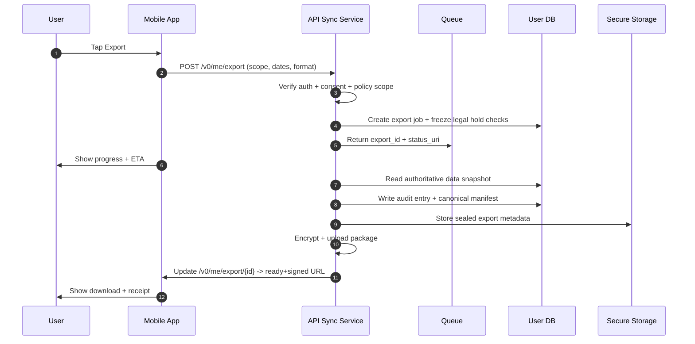
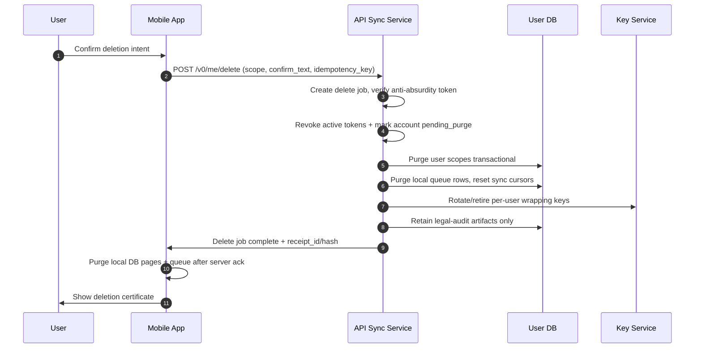
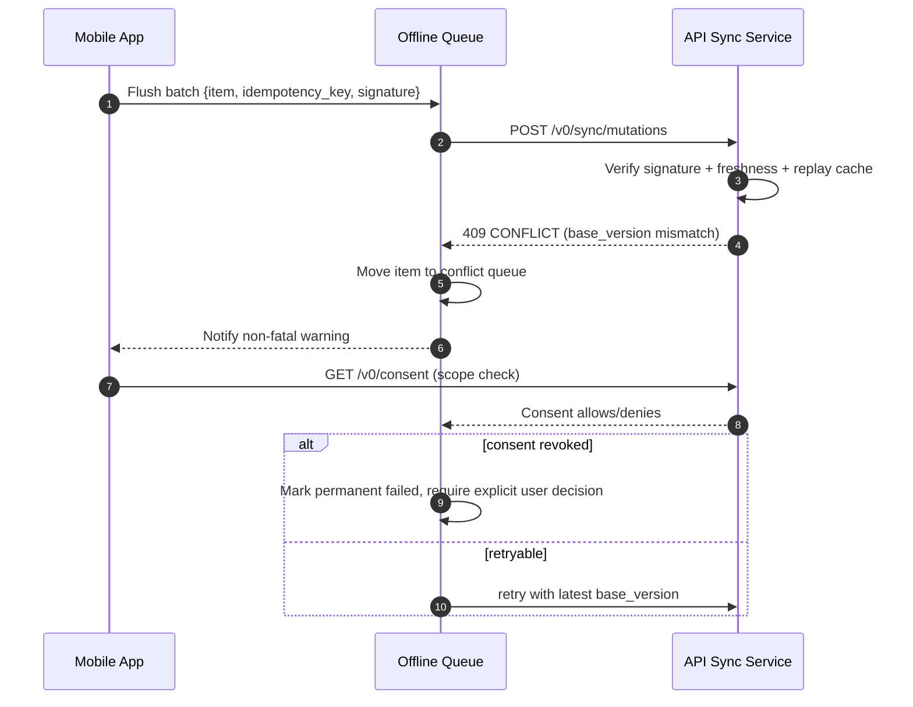

# ADR-017b: Launch-Blocking Security Implementation Spec (Consent, Export/Delete, Queue Integrity)

## Status

- **Implemented**
- Supersedes/operationalizes the security posture from `ADR-017` for production readiness.

## Current implementation status (2026-02-25)

- **Consent evidence**
  - `user_consent_ledger` and `user_consent_ledger_events` are available in migration `2026-02-25_security_consent_export_delete.sql`.
  - Consent events are append-only with hash chaining fields (`event_hash`, `prev_hash`).
  - `/v0/me/consent` writes immutable grant/revoke/update evidence and returns status history.
- **Export/delete**
  - `/v0/me/export` and `/v0/me/delete` are implemented with idempotency keys, async status polling, signed completion receipts, and summary counts.
  - Hard delete path explicitly purges queue rows, entity versions, and signing keys; exports are invalidated and delete receipt is generated.
- **Offline queue integrity**
  - `/v0/sync/mutations` enforces required signatures, idempotency checks, TTL checks, replay-window lookups, and conflict semantics.
  - Expired replay cache entries for a key are cleared before accepting a fresh envelope using the same key.
- **Open items**
  - Account binding and recovery workflows for anonymous mode are defined in policy but still need dedicated key bootstrap/rebind endpoints.

## Scope

- Launch-blocking security controls for:
  - Durable consent evidence and revocation history
  - User data export/delete endpoints and proof artifacts
  - Offline mutation queue integrity and replay protection
  - Device/account key lifecycle and recovery behavior

## 1) Minimal production schema: durable consent ledger

### 1.1 Core principle

Consent is a first-class legal artifact, immutable by business logic and independently auditable.

- No implicit defaults.
- Never delete consent records without legal retention constraints.
- Consent state is versioned with revocation history.

### 1.2 SQL draft

```sql
-- Users are represented minimally by profile owner identity in account mode.
-- In anonymous mode, user pseudonym is stored as account_id_ref = NULL and device_subject_id is required.

create table if not exists user_consent_ledger (
  consent_id            text primary key default gen_random_uuid()::text,
  user_id               uuid not null,
  device_subject_id     text,
  tenant_scope          text not null default 'fodmap_app',

  policy_version        text not null,
  legal_basis           text not null check (legal_basis in ('consent', 'contract', 'legal_obligation', 'vital_interests', 'public_interest', 'legitimate_interests')),
  consent_scope         jsonb not null, -- e.g. {"symptom_logs":true,"diet_data":true,"analytics":false,"push":true}
  consent_method        text not null check (consent_method in ('explicit_checkbox', 'oauth_consent', 'in_app_sheet', 'api_admin', 'offline_cache_reconsent')),
  source                text not null check (source in ('mobile_app', 'web_fallback', 'support', 'api_internal')),
  source_ref            text,

  granted_at_utc        timestamptz not null default now(),
  revoked_at_utc        timestamptz,
  expires_at_utc        timestamptz,

  policy_fingerprint    text not null, -- hash over policy/versioned text used at grant time
  scope_signature       text not null, -- detached signature from app/client over canonical scope payload
  evidence_uri          text, -- optional immutable snapshot in immutable storage
  evidence_hash         text,

  revocation_reason     text,
  revocation_actor_id   uuid,
  revocation_ip_cidr    inet,

  status                text not null check (status in ('active','revoked','expired','superseded','invalidated')),
  parent_consent_id     text references user_consent_ledger(consent_id),
  replaced_by_consent_id text references user_consent_ledger(consent_id),

  created_at_utc        timestamptz not null default now(),
  created_by_actor_id    uuid,
  updated_at_utc        timestamptz not null default now(),
  updated_by_actor_id    uuid
);

-- Enforce a single active record per user/device_subject tuple.
create unique index if not exists uq_user_active_consent
  on user_consent_ledger (user_id)
  where status = 'active';

create index if not exists ix_user_consent_status
  on user_consent_ledger (user_id, status, granted_at_utc desc);

create index if not exists ix_consent_user_ts
  on user_consent_ledger (user_id, granted_at_utc desc);

create index if not exists ix_consent_device_subject
  on user_consent_ledger (device_subject_id, status);

-- Optional immutable history table for chain integrity and easy export/reporting.
create table if not exists user_consent_ledger_events (
  event_id      text primary key default gen_random_uuid()::text,
  consent_id    text not null references user_consent_ledger(consent_id),
  event_type    text not null,
  actor_type    text,
  actor_id      uuid,
  at_utc        timestamptz not null default now(),
  reason        text,
  metadata_json jsonb not null default '{}'::jsonb,
  event_hash    text not null,
  prev_hash     text
);

create index if not exists ix_consent_events_consent
  on user_consent_ledger_events (consent_id, at_utc desc);
```

### 1.3 Required minimal columns

- `policy_version`: legal text revision identifier.
- `legal_basis`: explicit GDPR basis.
- `consent_scope`: feature-level granularity.
- `consent_method`: proof of user intention capture channel.
- `granted_at_utc`, `revoked_at_utc`: temporal evidence.
- `source`: platform origin of event.
- `revocation_reason/history`: reason and actor trail.

## 2) Concrete API contracts

### 2.1 Conventions

- Base path: `/v0/me`
- Auth required for account mode: Bearer + active session.
- Anonymous mode uses device-bound one-time grant tokens for queue and data export/delete scoped to that device subject.
- All endpoint responses include `idempotency_key` echo for traceability when provided.
- UTC timestamps in ISO-8601.

## 2.2 `GET /v0/me/consent`

#### Query

- Optional `?policy_version=...` to retrieve consent for latest or specific policy version
- Optional `?as_of=...` for historical read

#### Response 200

```json
{
  "user_id": "uuid",
  "consent_state": {
    "active": true,
    "consent_id": "uuid",
    "policy_version": "gdpr-v2.1.0",
    "legal_basis": "consent",
    "scope": {
      "symptom_logs": true,
      "diet_data": true,
      "recommendation_personalization": true,
      "analytics": false,
      "marketing": false
    },
    "method": "in_app_sheet",
    "granted_at_utc": "2026-02-25T09:00:00Z",
    "source": "mobile_app"
  },
  "history": [
    {
      "event": "granted",
      "at_utc": "2026-02-25T09:00:00Z",
      "policy_version": "gdpr-v2.1.0",
      "source": "mobile_app"
    },
    {
      "event": "revoked",
      "at_utc": "2026-02-24T08:00:00Z",
      "reason": "user_action"
    }
  ]
}
```

### 2.3 `POST /v0/me/consent`

#### Request

```json
{
  "policy_version": "gdpr-v2.1.0",
  "action": "grant|revoke|update",
  "scope": {
    "symptom_logs": true,
    "diet_data": true,
    "recommendation_personalization": true,
    "analytics": false,
    "push": true
  },
  "method": "explicit_checkbox",
  "source": "mobile_app",
  "source_ref": "privacy_sheet:2026-02-25_fr-fr",
  "language": "fr-FR",
  "signature_payload": "base64(json_canonical_payload)",
  "signature": "base64(ed25519_signature)",
  "public_key_id": "k1"
}
```

#### Response 201/200

```json
{
  "consent_id": "uuid",
  "status": "active|revoked|superseded",
  "policy_version": "gdpr-v2.1.0",
  "legal_basis": "consent",
  "effective_at_utc": "2026-02-25T09:01:00Z",
  "previous_consent_id": "uuid|null",
  "evidence_uri": "s3://ledger/consent/uuid.json",
  "evidence_hash": "sha256:..."
}
```

#### Error semantics

- `409 CONFLICT`: pending deletion mode or mismatched signature payload.
- `410 GONE`: user account hard-deleted.
- `422 UNPROCESSABLE_ENTITY`: malformed scope or unknown policy version.

### 2.4 `GET /v0/me/export`

#### Request

- Query:
  - `format=ndjson|json`
  - `from_ts_utc`, `to_ts_utc`
  - `include=consent,profile,symptoms,diet_logs,swap_history`
  - `anonymize=true|false` (default true for anonymous export, false only in explicit account flow)

#### Response 202

```json
{
  "export_id": "uuid",
  "status": "accepted",
  "requested_at_utc": "2026-02-25T10:05:00Z",
  "expiry_at_utc": "2026-02-25T10:35:00Z",
  "status_uri": "/v0/me/export/{export_id}",
  "status": "queued"
}
```

#### Poll response 200 (`/v0/me/export/{export_id}`)

```json
{
  "export_id": "uuid",
  "status": "ready|processing|failed|ready_with_redactions",
  "completed_at_utc": "2026-02-25T10:20:00Z",
  "scope": {
    "included_tables": ["user_profile", "symptom_logs", "swap_history"],
    "redactions": ["email_last_4", "device_id_hash"]
  },
  "download_url": "https://storage.example/export/uuid/file",
  "manifest": {
    "rows_by_domain": {
      "symptom_logs": 123,
      "diet_logs": 87,
      "swap_history": 44
    },
    "sha256": "...",
    "cipher": "AES-256-GCM",
    "public_key_fingerprint": "fp-2026-02"
  },
  "proof": {
    "export_receipt_id": "uuid",
    "issued_at_utc": "2026-02-25T10:20:01Z",
    "operator": "api",
    "policy_version": "gdpr-v2.1.0"
  },
  "failure": {
    "code": "EXPORT_LOCKED_DATA_MISSING",
    "message": "Data unavailable due to legal hold"
  }
}
```

### 2.5 `POST /v0/me/delete`

#### Request

```json
{
  "scope": "all|symptoms_only|diet_only|analytics_only",
  "soft_delete_window_days": 0,
  "hard_delete": true,
  "confirm_text": "SUPPRIMER MES DONNÉES",
  "reason": "user_request|privacy_request|inactive|other",
  "client_nonce": "uuid",
  "idempotency_key": "uuid-v7"
}
```

#### Response 202

```json
{
  "delete_request_id": "uuid",
  "status": "accepted",
  "requested_at_utc": "2026-02-25T11:00:00Z",
  "scope": "all",
  "local_effective_ttl_seconds": 60,
  "server_effective_at_utc": "2026-02-25T11:01:10Z",
  "proof_uri": null,
  "status_uri": "/v0/me/delete/{delete_request_id}"
}
```

#### Poll response

```json
{
  "delete_request_id": "uuid",
  "status": "processing|queued|completed|failed|partial",
  "completed_at_utc": "2026-02-25T11:01:30Z",
  "summary": {
    "consent_records_touched": 2,
    "symptom_logs_deleted": 123,
    "diet_logs_deleted": 87,
    "swap_history_deleted": 44,
    "queue_items_dropped": 6,
    "exports_invalidated": 2
  },
  "proof": {
    "delete_receipt_id": "uuid",
    "receipt_sha256": "...",
    "issuer": "api",
    "policy_version": "gdpr-v2.1.0"
  },
  "retained_artifacts": [
    {
      "type": "audit_ptr",
      "reason": "fraud_and_security",
      "retention_until_utc": "2029-02-25T00:00:00Z"
    }
  ]
}
```

## 3) Offline mutation queue cryptographic guardrails

### 3.1 Envelope object

```json
{
  "queue_item_id": "uuid",
  "idempotency_key": "sha256(tenant|device|logical-op|payload-hash)",
  "device_id": "dvc-...",
  "app_install_id": "inst-...",
  "user_id": "uuid|null",
  "op": "create_symptom_log|update_profile|accept_swap|discard_swap",
  "entity_type": "symptom_log|diet_log|recommendation_action",
  "entity_id": "uuid",
  "client_seq": 1023,
  "base_version": 14,
  "attempt": 1,
  "ttl_seconds": 172800,
  "created_at_utc": "2026-02-25T08:13:11Z",
  "payload": {
    "encrypted_b64": "..."
  },
  "aad": {
    "language": "fr-FR",
    "app_build": "1234",
    "consent_required_hash": "..."
  },
  "signature": "base64(Ed25519 over canonical envelope)",
  "signature_kid": "kid-2026-01",
  "ciphertext": "base64(AEAD(payload, nonce, key))",
  "nonce": "base64(12 bytes)",
  "tag": "base64(16 bytes)"
}
```

### 3.2 Rules

1. **idempotency_key requirement**
   - Required on every mutation write request.
   - Key derived from immutable tuple and monotonic `client_seq`.
   - Server persists `(idempotency_key, user|device, op, payload_hash)` with TTL.

2. **Signing strategy**
   - Default: Ed25519 per-device signing key, rotated quarterly.
   - Signature over canonical JSON with stable field ordering.
   - Verification failure => hard reject, queue item quarantined.

3. **Replay cache**
   - Server-side distributed store with short-window and durable history window:
     - short window: `created_at_utc` + 24h for replay detection
     - durable dedupe for unconfirmed writes until acked by user-state cleanup.
   - Replayed envelope accepted only if exact same `idempotency_key` and identical body hash; otherwise flagged as conflict.

4. **Tamper detection**
   - AEAD `tag` validation on payload decrypt.
   - HMAC/EdDSA signature ensures metadata integrity.
   - Optional `mutability hash` linking queue items in chain:
     - `queue_item_hash = SHA256(prev_queue_item_hash || canonical_envelope)`
     - prevents targeted sequence tampering.

5. **Failure semantics**
   - `401`: signature key revoked/untrusted.
   - `403`: consent scope denies requested operation.
   - `409`: duplicate idempotency with different payload hash.
   - `412`: stale `base_version` / conflict candidate.
   - `423`: queue rejected due pending deletion/export hold.
   - `429`: burst/replay attempt throttled.
   - `500`: crypto subsystem failure; mark as retryable and keep local copy.

### 3.3 Sync-reject behavior

- Rejected queue items remain encrypted locally with server reason code.
- Client schedules exponential backoff with max attempts and user-visible status.
- Tamper/replay violations move item to a local **quarantine lane** and stop automatic retries pending user intervention.

## 4) Secure deletion semantics

### 4.1 Local wipe

- Remove local cleartext cache after encryption key discard.
- Purge:
  - symptom and diet drafts,
  - cached recommendation graph,
  - sync cursors bound to user data,
  - queued user-specific writes not yet acknowledged.
- Do not delete:
  - anonymous app preferences and non-sensitive app telemetry unless privacy mode configured.

### 4.2 Server purge

- Identity resolution -> scope filtering -> transactional purge per domain:
  - profile, consent metadata,
  - symptom logs, diet logs, swap interactions,
  - app preferences linked to profile,
  - queue snapshots pending send,
  - active sessions and refresh tokens.
- Analytics aggregates are reduced to retention-safe summary where legally permitted, else fully purged.
- Legal hold / fraud lockouts are explicit exceptions; then action marked partial with reason.

### 4.3 Queue purge

- Remove pending user-bound queue rows immediately on successful delete request.
- Remove queued items already ingested from local dedupe index but retain immutable audit journal entry with hash-only evidence.
- Invalidate idempotency and replay records after purge window.

### 4.4 Purge proof receipt (both export and delete)

```text
{
  receipt_id: uuid,
  request_id: uuid,
  actor: user|support_agent,
  scope: all|partial,
  completed_at_utc,
  entity_counts: {
    consent, profile, symptoms, diet, swaps, queue_items, exports,
  },
  retention_exceptions: [
    {domain: audit_log, reason: legal_obligation, until_utc: ...}
  ],
  manifest_hash: sha256(concatenated_domain_counts + timestamps + actor + request_id),
  proof_format: "json+jws",
  proof_signature: JWS(signature over receipt)
}
```

## 5) Key lifecycle and recovery constraints (anon vs account)

### 5.1 Anonymous mode

- Key derivation tied to app install and optionally device biometrics.
- No durable identity keys persisted across uninstall.
- Sync is disabled for health data by default unless opt-in, in which case pseudo-account key rotates per session grant.
- Deletion request in anon mode clears:
  - local DB encryption key,
  - queue keys,
  - sync cursor,
  - pending queue.
- Recovery after reinstall requires fresh user action; no silent rebind.

### 5.2 Account mode

- Keys:
  - device encryption key wrapped by OS secure element,
  - server sync wrapping key tied to user identity + device trust policy,
  - queue signing key per device, revocable.
- Recovery options:
  - password/SSO reset revokes old sync+signing credentials,
  - new device re-enrollment required,
  - in-flight queue items may be dropped if replay impossible.

### 5.3 Failure constraints

- If key cannot be unwrapped, app enters safe mode:
  - read-only local content only,
  - queue sync disabled,
  - user prompted to reauthenticate/rebind.
- If secure deletion is requested during key corruption:
  - complete server-side deletion without local confirmation hash.
  - return `proof.untrusted=true` and trigger remediation ticket.

## 6) Sequence diagrams

### 6.1 Export sequence



### 6.2 Delete sequence



### 6.3 Sync reject sequence



## 7) Threat + mitigation update (aligned to ADR-017)

1. **Consent forgery via replayed signatures**
   - Impact: fake grant/revoke evidence.
   - Mitigation: signature + freshness TTL + consent policy hash + monotonic sequence.

2. **Export poisoning / data extraction by unauthorized actor**
   - Impact: exfiltration of sensitive data.
   - Mitigation: auth checks, scope-aware export filtering, short-lived signed URL, AES-256-GCM at rest, audit trail.

3. **Delete tampering / false completion notice**
   - Impact: non-compliant privacy claims.
   - Mitigation: immutable delete receipt signed by API and displayed with manifest hash + entity counts.

4. **Queue signature key theft**
   - Impact: forged writes from compromised device or malware.
   - Mitigation: hardware-backed key storage, key attestation, rapid rotation, automatic invalidation on anomaly.

5. **Replay of stale queue mutations after version rollback**
   - Impact: incorrect chronologies and duplicate actions.
   - Mitigation: `base_version` guard, idempotency key, dedupe cache, per-op conflict policy and user-visible sync status.

6. **Stale export/delete claims during partial legal holds**
   - Impact: user distrust, legal non-compliance.
   - Mitigation: partial status with explicit retention exceptions and proof artifact showing retained domains.

### 7.1 Implemented-mapping snapshot

| Threat                                     | Control in code                                                                                                                             | Route / artifact                                                                                                      |
| ------------------------------------------ | ------------------------------------------------------------------------------------------------------------------------------------------- | --------------------------------------------------------------------------------------------------------------------- |
| Consent forgery via replayed signatures    | Immutable event chain on consent writes (`user_consent_ledger_events.event_hash`) and server-side signature hash fallback for scope payload | `API /v0/me/consent`, `user_consent_ledger`, `user_consent_ledger_events`                                             |
| Export poisoning / unauthorized extraction | Authenticated `X-User-Id`, consent scope checks, idempotent export jobs, signed export receipts                                             | `API /v0/me/export`, `me_export_jobs`, `_build_export_receipt`                                                        |
| Delete false completion notice             | Signed deletion receipts, transactional purge summaries, key rotation/invalidation during hard delete                                       | `API /v0/me/delete`, `me_delete_jobs`, `_build_delete_receipt`, `SQL_DELETE_DEVICE_KEYS`                              |
| Queue key theft / forged payload           | Per-device key lookup + HMAC verification + signature algorithm constraint + replay cache/TTL                                               | `API /v0/sync/mutations`, `me_device_signing_keys`, `me_mutation_queue`                                               |
| Replay/stale mutation injection            | `idempotency_key` required, duplicate payload hash check, stale-key purge before re-acceptance, base_version guard                          | `API /v0/sync/mutations`, `SQL_GET_QUEUE_BY_IDEMPOTENCY`, `SQL_DELETE_QUEUE_BY_IDEMPOTENCY`, `SQL_GET_ENTITY_VERSION` |
| Partial legal-hold claims                  | Failed/partial delete status with retained summary counts and proof artifact                                                                | `me_delete_jobs.summary`, `DeletePollResponse.proof`                                                                  |

### 7.2 Immediate follow-ups

- Implement explicit anonymization mode and fresh key bootstrap on anonymous-mode re-install/recovery.
- Add `delete`/`export` payload signature fields for optional anti-tamper over request body before persistence.
- Add durable idempotency table for sync accept/reject outcomes (audit + quarantine lane metadata).
